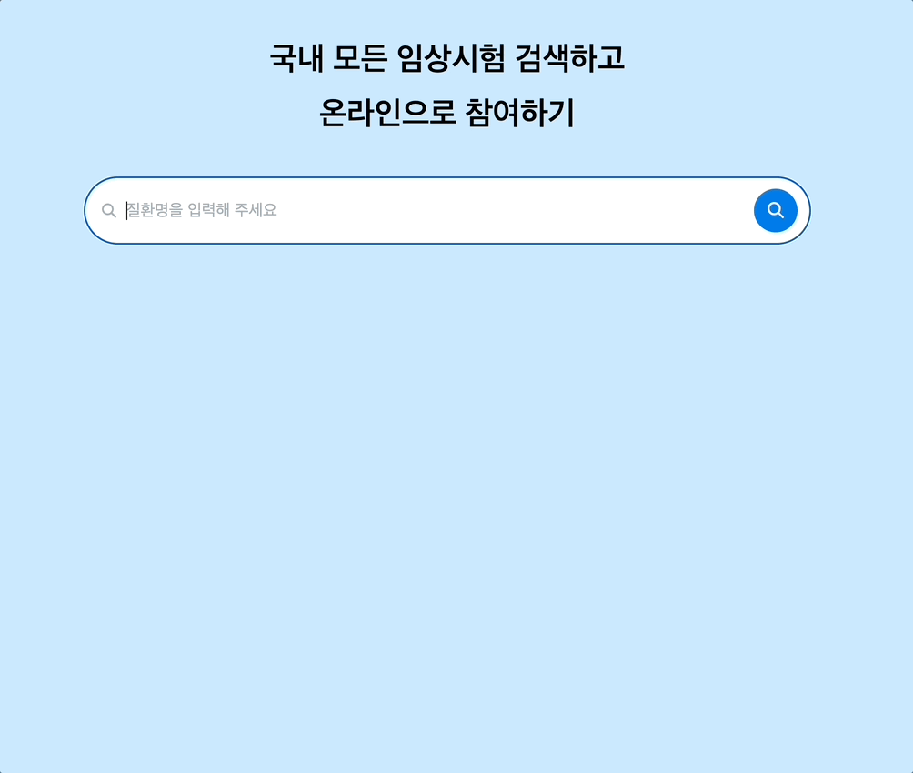

# clinical-trial-search

## 프로젝트 소개

- 목표 : 검색창 구현 + 검색어 추천 기능 구현 + 캐싱 기능 구현
- 주제 : [한국임상정보](https://clinicaltrialskorea.com/) 사이트에서 검색영역을 클론하기
- 작업 기간 : 2023.09.05 - 2023.09.08
- 팀 레포지토리 : [바로가기](https://github.com/pre-onboarding-12th-team3/pre-onboarding-12th-3-3)

## 배포 URL

[배포 URL 바로가기](https://clinical-trial-search-seven.vercel.app/)

## 기술 스택

      

## 설치 및 실행

1. 저장소 복제 (Clone Repository)

```zsh
$ git clone https://github.com/ukssss/clinical-trial-search.git
```

2. 종속성 설치 (Install Dependencies)

```zsh
$ npm install
```

3. 서버 및 애플리케이션 실행 (Run Server & Application)

```zsh
$ npm run all
```

## 폴더 구조

```base
src
 ┣ api
 ┃ ┣ axios.ts
 ┃ ┗ index.ts
 ┣ assets
 ┃ ┗ react.svg
 ┣ components
 ┃ ┣ SearchBar.tsx
 ┃ ┣ SearchButton.tsx
 ┃ ┣ SearchResult.tsx
 ┃ ┣ Title.tsx
 ┃ ┗ index.ts
 ┣ constants
 ┣ customTypes
 ┃ ┣ disease.d.ts
 ┃ ┗ svg.d.ts
 ┣ hooks
 ┃ ┣ index.ts
 ┃ ┣ useDebounce.ts
 ┃ ┣ useKeyControl.ts
 ┃ ┗ useLocalCache.ts
 ┣ pages
 ┃ ┣ ErrorPage.tsx
 ┃ ┣ SearchPage.tsx
 ┃ ┗ index.ts
 ┣ routes
 ┃ ┗ router.tsx
 ┣ utils
 ┃ ┗ emphasisText.tsx
 ┣ App.css
 ┣ App.tsx
 ┣ index.css
 ┣ main.tsx
 ┗ vite-env.d.ts
```

## 구현 내용

| Search Page                              |
| ---------------------------------------- |
|  |

## 커밋 컨벤션

```base

- Feat | 새로운 기능을 추가
- Fix | 버그 수정
- Design | CSS 등 사용자 UI 디자인 변경
- !BREAKING CHANGE | 커다란 API 변경의 경우
- !HOTFIX | 급하게 치명적인 버그를 고쳐야 하는 경우
- Style | 코드 포맷 변경, 세미 콜론 누락, 코드 수정이 없는 경우
- Refactor | 프로덕션 코드 리팩토링
- Comment | 필요한 주석 추가 및 변경
- Docs | 문서 수정
- Test | 테스트 코드, 리팩토링 테스트 코드 추가, Production Code(실제로 사용하는 코드) 변경 없음
- Chore | 빌드 업무 수정, 패키지 매니저 수정, 패키지 관리자 구성 등 업데이트, Production Code 변경 없음
- Rename | 파일 혹은 폴더명을 수정하거나 옮기는 작업만인 경우
- Remove | 파일을 삭제하는 작업만 수행한 경우

```
